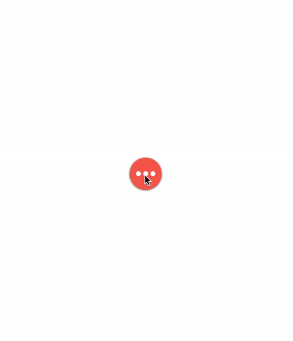

# HActionButton

[](https://travis-ci.org/popodidi/HActionButton)
[](http://cocoapods.org/pods/HActionButton)
[](http://cocoapods.org/pods/HActionButton)
[](http://cocoapods.org/pods/HActionButton)

An customizable action button subclassing UIView where the mainButton, itemButton, and animation can all be customized.

Besides flexibility of customization, default settings and built-in functions also provide great usability of the pod.

### Features

- [x] Customized configuration
	- Main button
	- Item button
	- Background view
	- Item position
	- Animation
		- Duration
		- Configuration for active/inactive state
- [x] DataSource protocol
	- Set number of item buttons
	- `optional` Item buttons configuration
	- `optional` Center position of each item button
- [x] Delegate protocol
	- Item button action
	- `optional` Function called after action button did become active/inactive
- [x] Animation delegate protocol
	- `optional` Animation time
	- `optional` Main button, item button and background view configuration for active/inactive status
- [x] Documentation

### Demo




## Example

To run the example project, clone the repo, and run `pod install` from the Example directory first.


## Installation

HActionButton is available through [CocoaPods](http://cocoapods.org). To install
it, simply add the following line to your Podfile:

```ruby
pod "HActionButton"
```

Swift version | version
---- | ----
2.3 | 2.0.x
3.0 | 2.1.0 or later

## Get Started

### Add to view
You can either add `HActionButton` programmatically with code

``` swift
let actionButton = HActionButton()
view.addSubview(actionButton)
// Customized configuration
// actionButton.mainButton.backgroundColor = UIColor.blueColor()
// actionButton.backgroundView.backgroundColor = UIColor.darkGrayColor()
// .
// .
```

or simply drag and drop an UIView in storyboard (Interface Builder) and set the class to `HActionButton`.

### Implements DataSource and Delegate protocol
```swift
class ViewController: UIViewController, HActionButtonDataSource, HActionButtonDelegate{
	@IBOutlet weak var actionButton: HActionButton!
	// .
	// .
	// .
	override func viewDidLoad(){
		super.viewDidLoad()	
		actionButton.dataSource = self
		actionButton.delegate = self
		//.
		//.
		//.
	}
	// .
	// .
	// .
   // MARK: - HActionButtonDataSource
   func numberOfItemButtons(actionButton: HActionButton) -> Int {
       return 20
   }
   func actionButton(actionButton: HActionButton, itemButtonAtIndex index: Int) -> UIButton {
       // return circle button with random color by default
       return HActionButton.CircleItemButton(actionButton)
        
   }
   func actionButton(actionButton: HActionButton, relativeCenterPositionOfItemAtIndex index: Int) -> CGPoint{
       // return circle button with random color by default
       return HActionButton.EquallySpacedArcPosition(actionButton, atIndex: index, from: 0, to: 2 * M_PI)
   }
   
   // MARK: - HActionButtonDelegate
   func actionButton(actionButton: HActionButton, didClickItemButtonAtIndex index: Int) {
       actionButton.toggle()
       print("button \(index) clicked")
   }
}
```

Now, your action button is supposed to work. Checkout the following parts to customize the action button.

## Customize main button

The main action button can be customized by configure `mainButton`, which is defined in `HActionButton` class.

```swift
// swift 2.3
public var mainButton: UIButton!
// swift 3.0
open var mainButton: UIButton!
```

## Protocols

### HActionButtonDataSource

Implement to customize each item button.

```swift
class ViewController: UIViewController, HActionButtonDataSource{
	// .
	// .
	// .
   // MARK: - HActionButtonDataSource
   func numberOfItemButtons(actionButton: HActionButton) -> Int {
       return 20
   }
   // Optional
   func actionButton(actionButton: HActionButton, itemButtonAtIndex index: Int) -> UIButton {
       // return circle button with random color by default
       return HActionButton.CircleItemButton(actionButton)
        
   }
   // Optional
   func actionButton(actionButton: HActionButton, relativeCenterPositionOfItemAtIndex index: Int) -> CGPoint{
       // return circle button with random color by default
       return HActionButton.EquallySpacedArcPosition(actionButton, atIndex: index, from: 0, to: 2 * M_PI)
   }
}
```

### HActionButtonDelegate

Implement to delegate the button action.

```swift
class ViewController: UIViewController, HActionButtonDataSource, HActionButtonDelegate{
	// .
	// .
	// .
   // MARK: - HActionButtonDelegate
   func actionButton(actionButton: HActionButton, didClickItemButtonAtIndex index: Int) {
       actionButton.toggle()
       print("button \(index) clicked")
   }
   // Optional
   func actionButton(actionButton: HActionButton, didBecome active: Bool) {
       
   }
}
```

### HActionButtonAnimationDelegate

Implement to customize the animation

```swift
class ViewController: UIViewController, HActionButtonDataSource, HActionButtonDelegate, HActionButtonAnimationDelegate{
	// .
	// .
	// .
   // MARK: - HActionButtonAnimationDelegate
   // Optional
   func actionButton(actionButton: HActionButton, animationTimeForStatus active: Bool) -> NSTimeInterval {
       // return 0.3 by default
       return active ? 2 : 0.3
   }
   // Optional
   func actionButton(actionButton: HActionButton, confugureMainButton mainButton: UIButton, forStatus active: Bool) {
       // rotate button with PI/2 back and forth for status by default
       HActionButton.RotateButton(mainButton, byAngle: M_PI/4, forStatus: active)
   }
   // Optional
   func actionButton(actionButton: HActionButton, confugureItemButton itemButton: UIButton, atIndex index: Int, forStatus active: Bool) {
       // set alpha of itemButton by default
       itemButton.alpha = CGFloat(active)
   }
   // Optional
   func actionButton(actionButton: HActionButton, confugureBackgroundView backgroundView: UIView, forStatus active: Bool) {
       // set alpha of backgroundView by default
       backgroundView.alpha = CGFloat(active)
       backgroundView.backgroundColor = UIColor(red: CGFloat(drand48()), green: CGFloat(drand48()), blue: CGFloat(drand48()), alpha: 0.4)
   }
}
```

## Author

Hao


## License

HActionButton is available under the MIT license. See the LICENSE file for more info.
